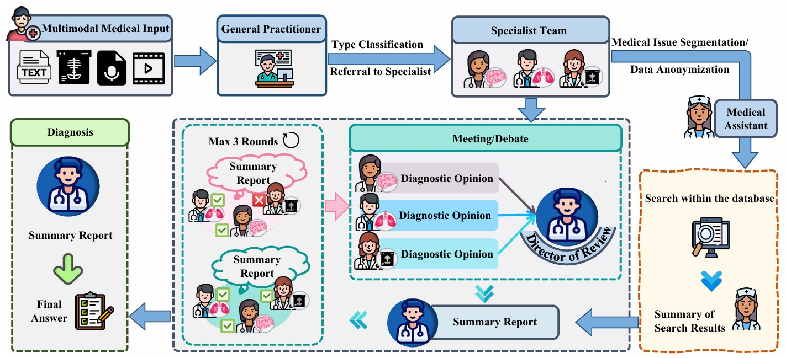
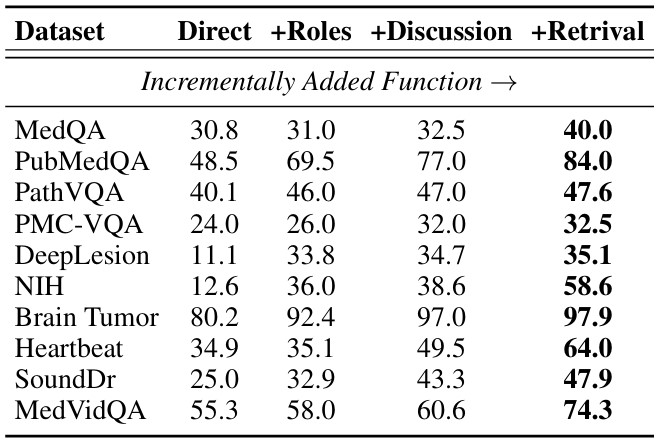

# MAM: ModularMulti-Agent Framework for Multi-Modal Medical Diagnosis via Role-Specialized Collaboration

[📢 [Paper](https://github.com/yczhou001/MAM)] [[Inference](https://github.com/yczhou001/MAM)] [[Dataset](https://github.com/yczhou001/MAM)] [[Models](https://github.com/yczhou001/MAM)]

<p align="center">  </p>

## 📰 News
* **[2025.00.00]** 
* **[2025.00.00]** 
* **[2025.06.05]** [Project Page](https://github.com/yczhou001/MAM) is released.
* **[2025.05.16]** [MAM](https://github.com/yczhou001/MAM) is accepted as ACL 2025 (findings).

## Abstract

Recent advancements in medical Large Language Models (LLMs) have showcased their powerful reasoning and diagnostic capabilities. Despite their success, current unified multimodal medical LLMs face limitations in knowledge update costs, comprehensiveness, and flexibility. To address these challenges, we introduce the Modular Multi-Agent Framework for Multi-Modal Medical Diagnosis (MAM). Inspired by our empirical findings highlighting the benefits of role assignment and diagnostic discernment in LLMs, MAM decomposes the medical diagnostic process into specialized roles: a General Practitioner, Specialist Team, Radiologist, Medical Assistant, and Director, each embodied by an LLM-based agent. This modular and collaborative framework enables efficient knowledge updates and leverages existing medical LLMs and knowledge bases. Extensive experimental evaluations conducted on a wide range of publicly accessible multimodal medical datasets, incorporating text, image, audio, and video modalities, demonstrate that MAM consistently surpasses the performance of modality-specific LLMs. Notably, MAM achieves significant performance improvements ranging from 18% to 365% compared to baseline models. For more details, please refer to the [paper](https://github.com/yczhou001/MAM).

## Highlights

* We evaluate our MAM framework in **multimodal medical diagnosis tasks** through comprehensive experiments on **several publicly available multimodal medical datasets**.
* Experimental results demonstrate that the MAM framework consistently **outperforms specific-modal LLMs** across various medical datasets and data modalities. 
* We conduct **ablation studies**, **consistency analysis**, and **sensitivity analyses** regarding the number of discussion rounds and roles to gain deeper insights into the roles of individual components and the operational mechanisms of the framework.

## Experimental results
* Ablation study of our MAM framework. The “Direct” represents the baseline. From left to right, we incrementally addfunctions. “+Retrieval” is our full MAM framework.
<p align="center">  </p>

For more details, please refer to the [paper](https://github.com/yczhou001/MAM).

## Contents
- [Install](#install)


## Install
1. Clone this repository and navigate to MAM folder
```bash
git clone https://github.com/yczhou001/MAM.git
cd MAM
```


